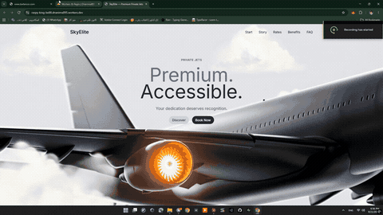

# SkyElite — Premium Private Jets



A full-bleed video hero landing page for a private jet charter brand. Built as a minimal, single-screen marketing page: a looping background video, a clean glass-free navigation bar, and a two-line headline built for impact.

▶️ **[View live demo](https://raspy-king-be88.dnanima895.workers.dev)**

## Highlights

- Full-viewport looping background video (`autoplay`, `muted`, `loop`) with no visible controls
- Responsive navigation — desktop inline links collapse into a mobile slide-down menu
- Two-tone headline styling (`Premium.` / `Accessible.`) using Tailwind utility classes with a couple of precise inline overrides
- Built with **React 18**, **TypeScript**, **Vite**, and **Tailwind CSS**
- Icons via [lucide-react](https://lucide.dev/)

## Tech stack

| | |
|---|---|
| Framework | React 18 + TypeScript |
| Build tool | Vite 6 |
| Styling | Tailwind CSS 3 |
| Icons | lucide-react |

## Run it locally

```bash
npm install
npm run dev
```

Then open the local URL Vite prints (defaults to `http://localhost:5173`).

## Build for production

```bash
npm run build
npm run preview
```

Output is written to `dist/`.
